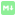

<p align="center">
  
</p>

<h1 align="center">Godot-MarkdownLabel</h1>

<p align="center">
  <b>A Markdown rendering Control for Godot 4, built for UI text, documentation panels, and AI-style streaming output.</b>
</p>

<p align="center">
  <a href="LICENSE.txt">
    
  </a>
  <a href="https://godotengine.org">
    
  </a>
  <a href="#platform-support">
    
  </a>
  <a href="https://github.com/godothub/godot-gif">
    
  </a>
</p>

<p align="center">
  MarkdownLabel is a Godot GDExtension node that renders a practical Markdown subset inside Godot UI.<br>
  It focuses on interactive documents, selectable text, images, long text, and incremental streaming.
</p>

---

## Why This Plugin?

Godot's built-in `RichTextLabel` is excellent for BBCode, but it does not directly target Markdown input or AI chat-style incremental text. MarkdownLabel fills that gap with a Godot-native `Control` node that parses Markdown and renders it through Godot text, theme, input, and scroll systems.

Use it when you want:

- Markdown text inside game UI, editor tools, documentation panels, or chat windows.
- Streaming-friendly rendering with `append_text()` and `finish_stream()`.
- Selectable and searchable rendered Markdown.
- Clickable links, images, footnotes, tables, blockquotes, and code blocks.
- Theme-driven styling instead of hard-coded UI colors.

> MarkdownLabel is not a browser engine and does not aim to be a full CommonMark, GitHub Markdown, HTML, or LaTeX renderer.

## Highlights

### Markdown Rendering

- ATX headings (`#` to `######`)
- Paragraphs and thematic breaks
- Fenced code blocks
- Ordered, unordered, nested, and task lists
- Nested blockquotes
- Tables
- Footnotes
- Inline bold, italic, bold-italic, code, strikethrough, and highlight
- Links, images, and linked images

### Images

- Loads images from `res://`, `user://`, `uid://`, `http://`, and `https://`.
- Local and remote images are loaded asynchronously.
- Failed images show a themeable `file_broken` icon.
- Failed images display alt text next to the broken icon when alt text exists.
- Empty alt text stays empty; no fallback file name is shown.
- Network PNG/JPG/WebP images are decoded at runtime.

### Streaming And Long Text

- `streaming_enabled` enables incremental tail reparsing for append-heavy workflows.
- `finish_stream()` performs final full parsing for document-level state such as footnotes and anchors.
- Stable layout prefix reuse reduces repeated work during streaming.
- Visible range drawing skips off-screen content to improve long document scrolling.

### Interaction

- Scrollable document view.
- Text selection, copy, select-all, and drag selected text.
- Search and scroll to search result.
- Link activation and optional external link opening.
- Heading anchors and scroll-to-anchor helpers.

### Theme Integration

All visual styling is read from the Godot theme system under the type name `MarkdownLabel`, including fonts, font sizes, colors, constants, styleboxes, and icons.

See the full theme reference:

```text
addons/markdown_label/docs/markdown_label_theme_reference.md
```

## Quick Start

### 1. Install The Addon

Copy the addon folder into your Godot project:

```text
addons/markdown_label
```

Then make sure the GDExtension file is present:

```text
addons/markdown_label/markdown_label.gdextension
```

### 2. Add A MarkdownLabel Node

Add a `MarkdownLabel` node to your scene and set its `text` property, or set Markdown from code:

```gdscript
@onready var markdown_label: MarkdownLabel = %MarkdownLabel

func _ready() -> void:
    markdown_label.set_markdown_text("# Hello\n\nThis is **Markdown**.")
```

### 3. Stream Text

For AI chat, console output, or other incremental text:

```gdscript
markdown_label.streaming_enabled = true
markdown_label.clear()

markdown_label.append_text("# Answer\n\n")
markdown_label.append_text("This paragraph is being streamed")
markdown_label.append_text(" in multiple chunks.")

markdown_label.finish_stream()
```

Call `finish_stream()` after the final chunk. It forces a final full parse so document-level features such as footnotes, anchors, and lists settle into their final state.

## Images And GIFs

MarkdownLabel supports standard Markdown image syntax:

```markdown


[](https://example.com)
```

Image behavior:

- Images load asynchronously.
- Loading images reserve inline space but do not show the broken icon yet.
- Broken image placeholders appear only after loading fails.
- `file_broken` is themeable.
- The default broken icon is `uid://cn51pvobw1gxd`, from `addons/markdown_label/icons/file_broken.svg`.

GIF support is optional:

- GIF playback depends on [godothub/godot-gif](https://github.com/godothub/godot-gif).
- If Godot-GIF is not installed and its runtime classes are unavailable, GIF images show the broken image placeholder.
- If Godot-GIF is installed, MarkdownLabel attempts to load local and remote GIFs as `GIFTexture` and advance frames inline.

## Platform Support

| Platform | Status | Notes |
|----------|--------|-------|
| Windows x86_64 | Supported | Main development and test target |
| Linux | Build required | Add the compiled library path to `markdown_label.gdextension` |
| macOS | Build required | Not shipped in this repository by default |
| Android | Build required | Network image behavior depends on export/network permissions |
| Web | Experimental | Remote image requests may be limited by browser/CORS/runtime constraints |

The repository currently ships/configures Windows x86_64 library entries:

```ini
windows.debug.x86_64 = "bin/markdown_label.windows.template_debug.x86_64.dll"
windows.release.x86_64 = "bin/markdown_label.windows.template_release.x86_64.dll"
```

Other platforms require building the GDExtension yourself.

## Requirements

- **Godot:** 4.5 or later in the extension configuration; development has primarily been tested with Godot 4.7.
- **Language:** C++17 or newer.
- **Build system:** SCons.
- **Dependency:** `godot-cpp` submodule.
- **Optional GIF dependency:** [godothub/godot-gif](https://github.com/godothub/godot-gif).

Initialize submodules before building:

```powershell
git submodule update --init --recursive
```

Build Windows debug:

```powershell
scons platform=windows target=template_debug arch=x86_64
```

Build Windows release:

```powershell
scons platform=windows target=template_release arch=x86_64
```

## Current Limitations

- LaTeX and math rendering are not supported yet.
- Full HTML rendering is not supported.
- Markdown compatibility is practical but not fully CommonMark/GitHub Markdown compliant.
- Network image cache is process-local only; there is no disk cache.
- GIF animation requires Godot-GIF and may depend on that plugin's runtime behavior.
- Very large remote images can increase memory and VRAM usage.
- Remote images may fail in restricted network environments or exported platforms without the required permissions.

## License

This repository is licensed under the MIT License. See [LICENSE.txt](LICENSE.txt).

## Acknowledgments

- [Godot Engine](https://godotengine.org)
- [godot-cpp](https://github.com/godotengine/godot-cpp)
- Optional GIF support via [godothub/godot-gif](https://github.com/godothub/godot-gif)
